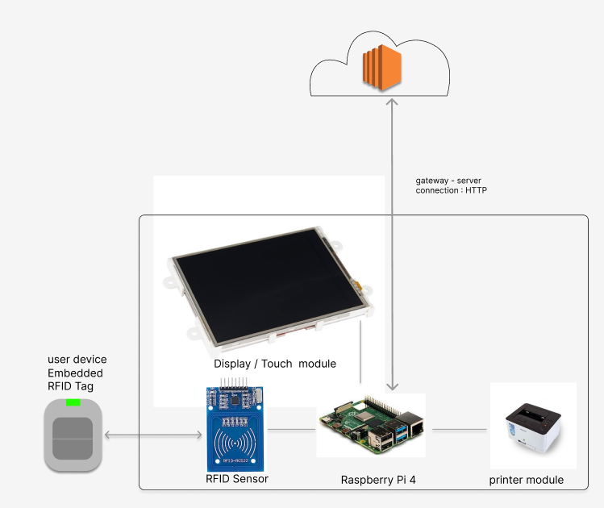
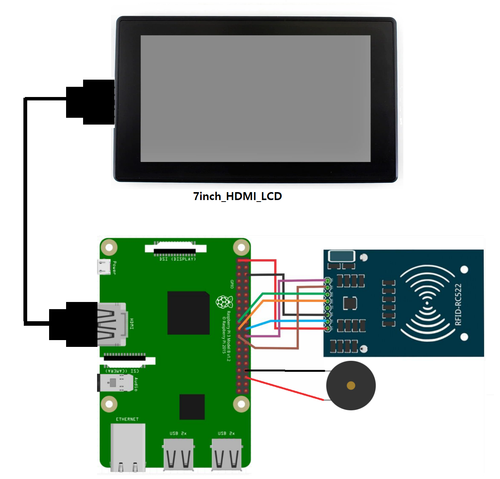
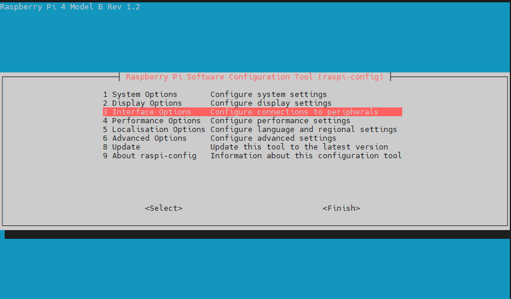
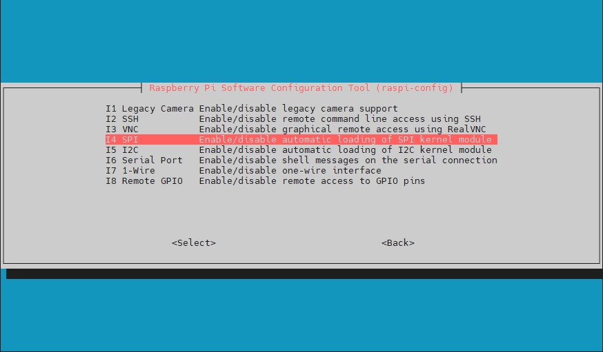
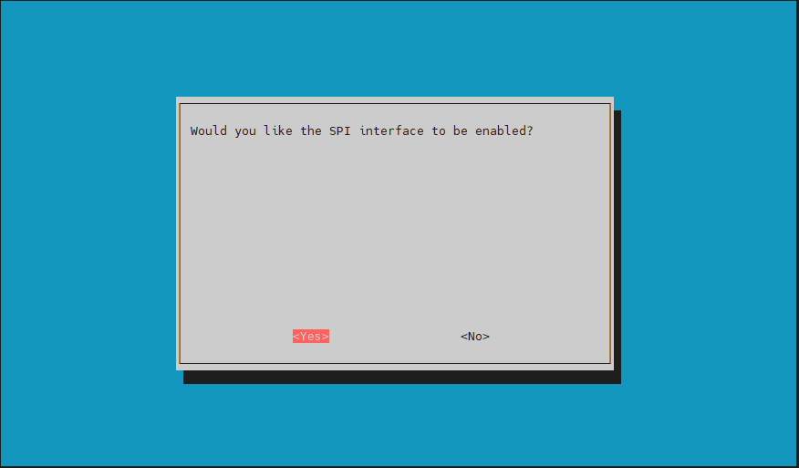

# KIOSK for ArtLink
여정 프로젝트의 IoT 시스템 중 User Device 기반으로 사용자와 상호작용하는 역할을 담당합니다.
<br><br>
KIOSK에 User Device를 태그하면 Device에 내장된 RFID를 인식하여, 이에 해당하는 웹 사이트를 보여 줍니다.
<br><br>
키오스크에서 작동하는 웹 사이트의 상세 기능은 [여기](https://lab.ssafy.com/s09-webmobile3-sub2/S09P12A202/-/tree/master/frontend/artlink-front/src/pages/Kiosk)에서 확인하실 수 있습니다.

## 시스템 구성도



## 기술 스택 및 라이브러리

### Operating System

| Project | Version | Description |
| --- | --- | --- |
| RaspberryPi OS | 1.7.5 | KIOSK base board|
### Libraries
Proejct | Version | Description
-|-|-|
RPi.GPIO|-|Rpi4 - Sensor 제어, 통신
mfrc522|1.4.10|RFID Tag scanning
selenium|4.10.0|Web browser control

## 개발 환경 구성(기기 셋업)

### 0. RaspberryPi OS Setting
해당 과정은 Rpi4 OS가 설치되어 있으면 생략할 수 있습니다.
<br><br>
(여기에 RaspberryPi OS 설치 방법 설명 TODO)

### 1. Rpi4 Cricuit
RPI 의 회로도는 다음과 같습니다. 아래 그림과 같이 회로를 구성합니다.



### 2. SPI connect Setting
RFID 리더기와 Rpi4는 SPI 통신으로 데이터를 주고 받습니다. 따라서 회로 구성 후 SPI 사용 설정을 진행합니다.

`sudo raspi-config`

이후 다음 이미지와 같이 설정을 진행합니다.







`Interface Options -> SPI -> Yes`

### 3. Rotate Display

해당 프로젝트는 600 * 1024 해상도로 구현이 되어 있습니다. 이에 맞게 화면 설정을 진행합니다.

아래와 같이 `config.txt` 파일과 `40-libinput.conf` 설정 파일을 변경해 줍니다.

`sudo vi /boot/config.txt`

```
# 해당 라인은 주석처리
#dtoverlay=vc4-kms-v3d
# 이하 라인은 추가
display_hdmi_rotate=1
hdmi_group=2
hdmi_mode=87
hdmi_cvt=1024 600 60 6 0 0 0
hdmi_drive=1
hdimi_force_hotplug=1
```

`sudo nano /usr/share/X11/xorg.conf.d/40-libinput.conf`

```
Section "InputClass"
	Identifier "libinput touchscreen catchall"
	MatchIsTouchscreen "on"
	Option "TransformationMatrix" "0 1 0 -1 0 1 0 0 1"
	MatchDevicePath "/dev/input/event*"
	Driver "libinput"
EndSection
```

2번, 3번 설정이 완료되었으면, `sudo reboot`를 통해 rpi4를 재시작합니다.

### 4. Install Libraries
재시작 후, 파이썬 및 라이브러리들을 설치합니다.

`sudo apt-get install python3`

`sudo apt-get install python-rpi.gpio`

`sudo pip3 install pi-rc522`

`pip3 install selenium`

### 5. Start KIOSK.py
이 후 `python3 KIOSK.py` 실행합니다.