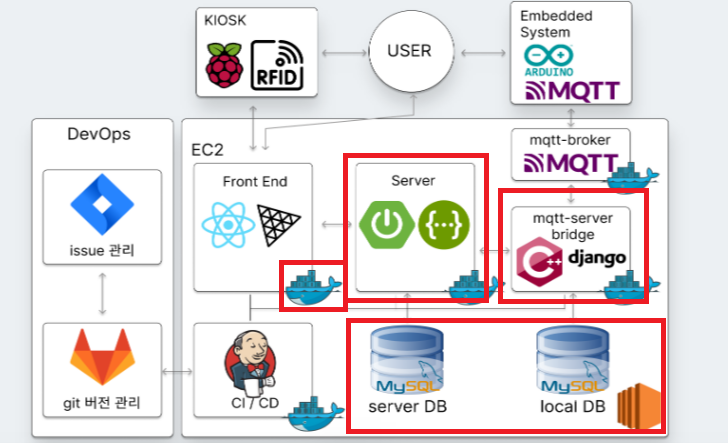
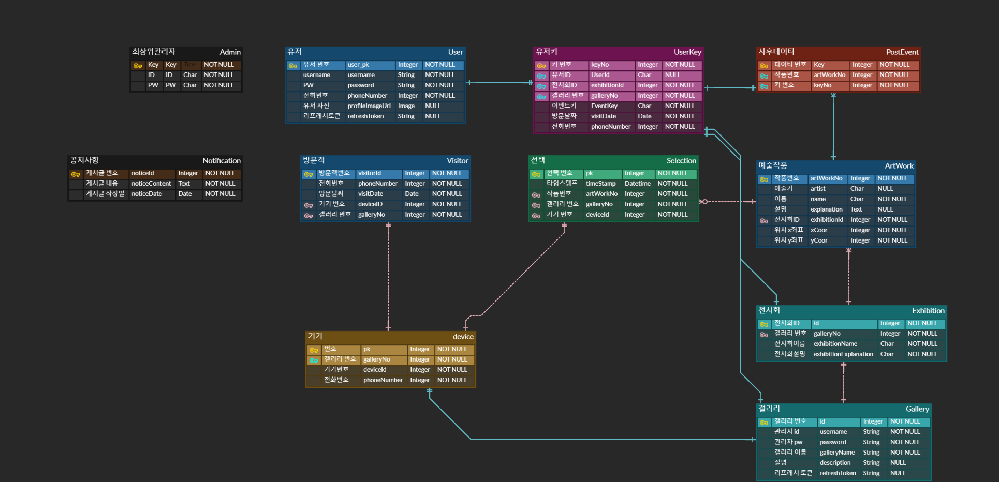
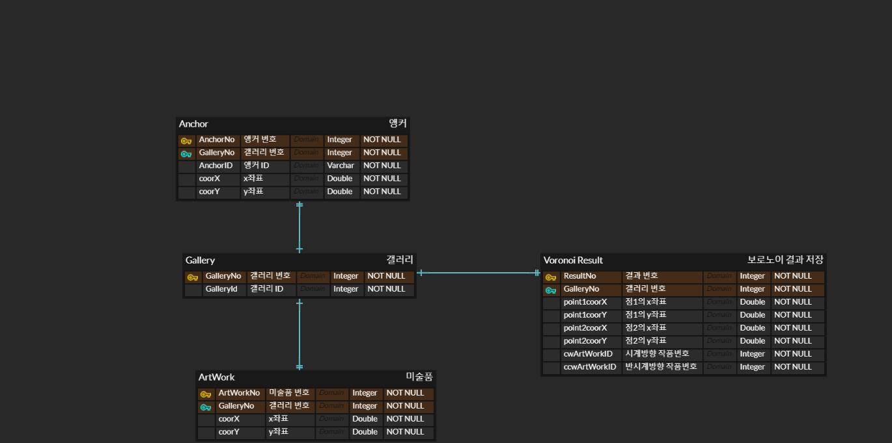

## 프로젝트 1: 간편한 원클릭 기기를 통한 미술품 기록 서비스

**기간**: 7주

**상세 주제**: 

위치를 기반으로 한 이벤트 트래킹 서비스

- 작가의 작품들은 그 작가의 여정이지만, 관람객에게는 미술관 관람 자체가 하나의 여정임.
- 우리는 관람객이 여정에 더욱 몰입할 수 있도록 해당 서비스를 제안고자 함.
- 특정 미술품 앞에서 원클릭 기기를 클릭하면 해당 미술품이 DB에 저장되고 관람 종료 후 선택한 미술품을 모아 영구히 볼 수 있는 서비스

**전체 시스템 구성도**

빨간색으로 표기한 부분은 본인이 담당하여 개발한 파트

- 사용 언어 : C++, Python(Django), Java(Spring)
- 개발 내용
    
    스프링 WAS 개발, 장고 Bridge Server 개발, DB 구상 및 핵심 알고리즘 개발.
    
    - 상세 내용
        - DB 구상: Spring, Django 서버에 필요한 ERD 및 관계 작성
        - 스프링 WAS ERD
            
            
            
        - 장고 ERD
            
            
            
        - 스프링 WAS API 명세서 :
            
            [Spring WAS API 명세서 ](https://lofty-cream-f31.notion.site/Spring-WAS-API-4447d04d34ff4b18b429469aa2d04c97?pvs=4)
            
        - 장고 브릿지 서버 API 명세서:
            
            [Django Bridge Server API 명세서](https://lofty-cream-f31.notion.site/Django-Bridge-Server-API-4933771287654371b570e7c073866a1f?pvs=4)
            
        - 스프링 Web Application Server (Java Corretto 11, Spring 2.7.13, Gradle 사용)
            - Amazon S3에 미술품의 이미지, 갤러리 포스터, 전시회 포스터 등을 등록하는 api 개발
            - 전시회 관람객이 전시회 내부에서 기기를 등록하는 것부터 기기 반납 후 해당 데이터가 저장되는 순간까지의 모든 api 개발
            - 전시회 관리 api 뿐만 아니라 전반적인 모든 부분에 대한 api 수정
        - 장고 Bridge Server (Python 3.9.17, Django 4.1.10 사용, C++ 사용)
            - MQTT와의 통신을 위해 필요한 서버 (MQTT가 C++, Python으로 다룰 수 있음)
            - MQTT를 사용하는 경우 사용자의 원클릭 기기와 미리 설치된 앵커 기기와의 거리만 주어질 뿐, 정확한 좌표를 모름. 이를 찾는 수학적인 방법을 제시 및 구현.
            - 가장 가까운 미술품을 찾는 알고리즘을 좀 더 최적화 함.(C++ 사용)
        - CI/CD
            - 스프링, 프론트 엔드 + Nginx를 Docker container에 올리기.

- 회고
    - 초기 목표
        - Spring WAS는 웹 어플리케이션으로 웹 서비스에 관련된 내용을, 장고 브릿지 서버는 IoT기기와의 통신과 해당과정에서 필요한 무거운 연산을 처리하는 서버로 분리하여 개발한다면 어느 단에서 오류가 나는지 확인도 편하고 개발하기에도 목적이 분리되어 개발하기 편하다고 생각하였다.
        - MQTT 의 신호를 받고 연산을 한 뒤 이 결과를 스프링에 전달하는 역할을 REST API가 작동하는 C++ 서버로 구현하려고 함.
        - Spring Server의 경우 REST API를 완벽히 지키며 재사용성 높고 깔끔한 코드를 작성하려고 하였음.
        - 개발 기간동안 세부 마일스톤을 잘 잡고 그 마일스톤을 주어진 기간 안에 끝마치고 1주 남기고 Test 및 발표 준비를 널널하게 하려고 하였음.
        - 임베디드 : 시스템에 알맞은 라이브러리를 작성하여 얹는 것을 목표로 하였음. click 시 timestamped 신호와 아이디를 송신하여 anchor에서는 수신하여 tag id 별로 측위를 계산하는 방식으로 개발하고자 함.
    - 문제점
        - 전체 : 각각의 기능 단위 테스팅의 부재, 전체 시스템 구동이 7주차에 이르러서야 되었음. 애자일 하지 못함
        - 임베디드: 신규 라이브러리 개발 불가.
        - 백엔드: 백엔드 간 코드 리뷰 미진행 ⇒ 매번 관련 코드에 대해 코드를 이해하는 시간이 필요했고 결과적으로 프로젝트의 지연으로 이어졌다.
        - 백엔드/임베디드: 백엔드 임베디드 간 통신을 구축하는 것이 매우 미뤄졌다. 초기에는 4주차 혹은 5주차에 되는 것으로 계획이 잡혀있었으나 미뤄짐 ⇒ 전체 시스템 구동이 몹시 늦어지고 동시에 구동하면서 생기는 버그들을 제대로 잡을 시간이 부족하였음.
    - 개선하려고 시도한 점
        - 임베디드 : single thread 기반의 비동기 시스템을 정의하는 것에 어려움이 존재, RAM을 활용하는 callback으로 버튼을 활성화 하였으나, boolean 하나를 flag 로 trigger하는 정도의 capacity를 보유함. 이를 바탕으로 가능한한 각 간단한 구조로 loop 내에서 지정된 timer를 기반으로 실행되도록 하였음. 그럼에도 loop간의 간섭이 지속적으로 발생함에 있어, 하드웨어의 문제인지 소프트웨어의 문제인지 판별하지 못한 문제점 존재함.
    - 추후 개선 방안
        - 도커, CI/CD 의 순서는 최초에 진행이 되어야함
        - 임베디드 : 개발 순서가 잘못 돼 있었음. 프로토타입 설계 → 프로토타입 제작에 걸린 시간이 너무 걸렸음. 변명 아닌 변명을 한다면 모듈 및 보드에 대한 이해가 떨어졌기 때문에, 모듈 단일 모듈을 구입하는 것으로 시간이 지체된 문제점이 가장 큰 (-) 요인이었음. 가능하면 패키징된 완제품을 구매하고, 전문가에게 외주를 맡기는 것이 하드웨어 제작의 human error를 방지하는 방법이 아니었는가 함.