# IPS(Indoor Positioning System) 핵심 기술

여정 프로젝트의 IoT 시스템 문서입니다. UWB(ultra wideband) 초광대역 통신모듈을 활용하여 미술관 내의 정밀 위치를 서버에 송신하는 역할을 담당합니다.

IoT 부문은 크게 2가지로 구분이 됩니다.

| 구분 | 설명 |
| --- | --- |
| 사용자 Tag | 사용자가 보유하고 있는 미술품을 등록하는 beacon 형 IoT 기기 |
| 거리측정용 Anchor | 사용자의 Tag로부터 거리를 측정하는 beacon |

| 구분 | 상세 기능 |
| --- | --- |
| 사용자 Tag |3-color LED를 통한 상태 출력 UWB 모듈을 ToF(Time of Flight) 기반 통신 거리 측정 MQTT 기반으로 Bridge와 통신 button을 탑재하여 이벤트 입력 |
| 거리측정용 Anchor | UWB 모듈을 ToF(Time of Flight) 기반 통신 거리 측정 |

## System Diagram

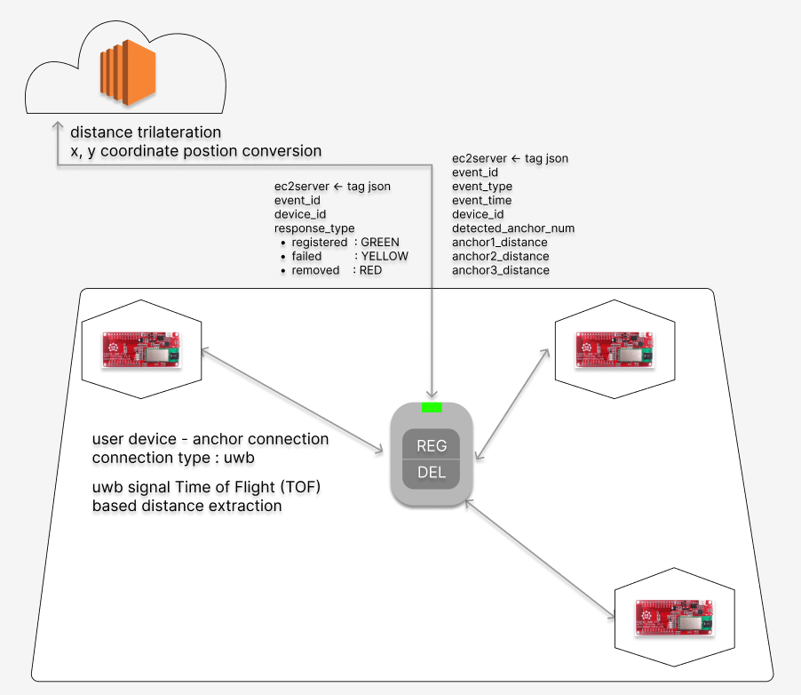

## 기술스택 및 라이브러리

### Operating System

| Project | Version | Description |
| --- | --- | --- |
| Arduino-IDE | 2.1.1 | 사용자 Tag base board |

### Libraries

| Project | Version | Description |
| --- | --- | --- |
| DW1000 | 0.9.0 | Library for UWB sensor control |
| arduino-dw1000 | 0.9.0 | Library for DW1000 modules with Arduino|
| pubsubclient | 2.8.0 | Tag(ESP32) - Bridge 간 MQTT 통신 |

## 개발 환경 구성(기기 셋업)

### 1. Arduino IDE 설치
[Arduino IDE](https://www.arduino.cc/en/software)를 설치합니다.

해당 사이트에서 자신의 운영체제와 맞는 프로그램을 다운로드합니다.

이 때, Arduino 파일 경로가 생성되는 경로를 기억해야 합니다.

일반적으로, `C:\Users\{사용자명}\Documents\Arduino` 에 경로가 생성됩니다.
### 2. ESP32 board 설정
사용하는 보드는 ESP32 보드입니다. Arduino-IDE 환경에서 이 보드를 다루기 위해서는 추가 설정이 필요합니다.

Arduino-IDE 에서 `File -> Preference` (한국어 버전이면 `파일 -> 환경설정`)을 클릭합니다.

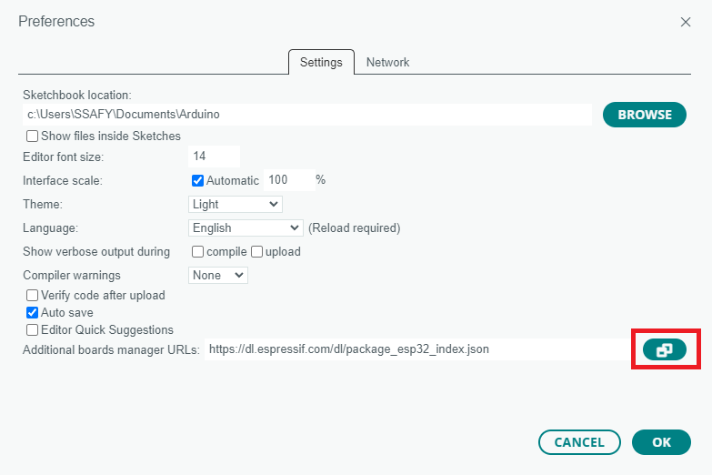

해당 부분을 클릭하고, 다음 Url을 입력합니다.

`https://dl.espressif.com/dl/package_esp32_index.json`

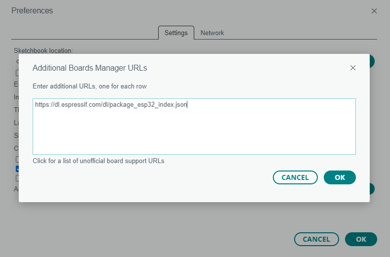

`Tools -> Board -> Board manager` 로 이동합니다.

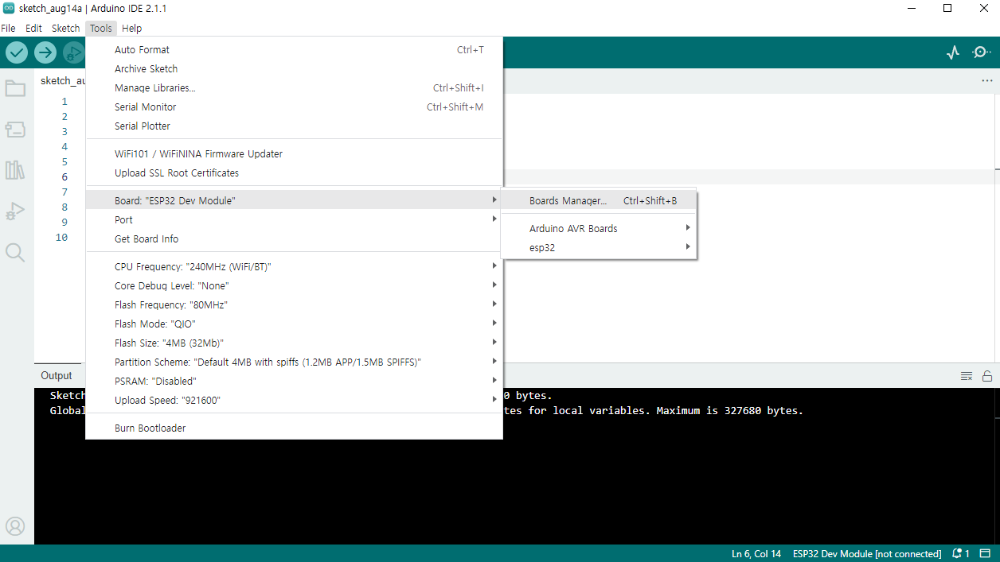

이동 후, `esp32` 를 검색하고, 아래 그림에 나온 매니저 파일을 다운로드 합니다. 
(README 작성 환경에서는 이미 설치가 되어있었습니다.)

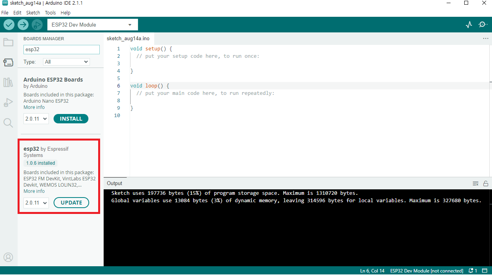

이 과정이 완료되면, `Tools -> Board` 에 `ESP32 Dev Module` 이 보입니다. 선택해 줍니다.

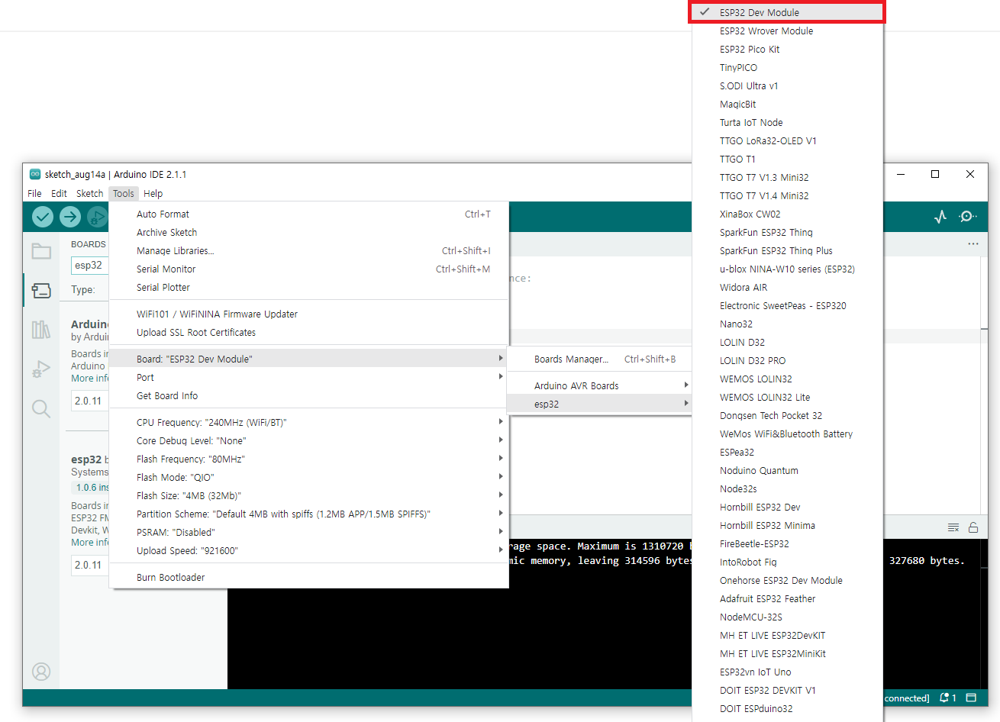

### 3. PC - Board 연결
PC와 ESP32 보드를 연결합니다. 보드가 연결된 USB Port 를 확인하고, IDE에서도 인식이 되었는지 확인합니다.

Port 연결이 정상적으로 나올 경우, 다음과 같은 이미지가 나와야 합니다.

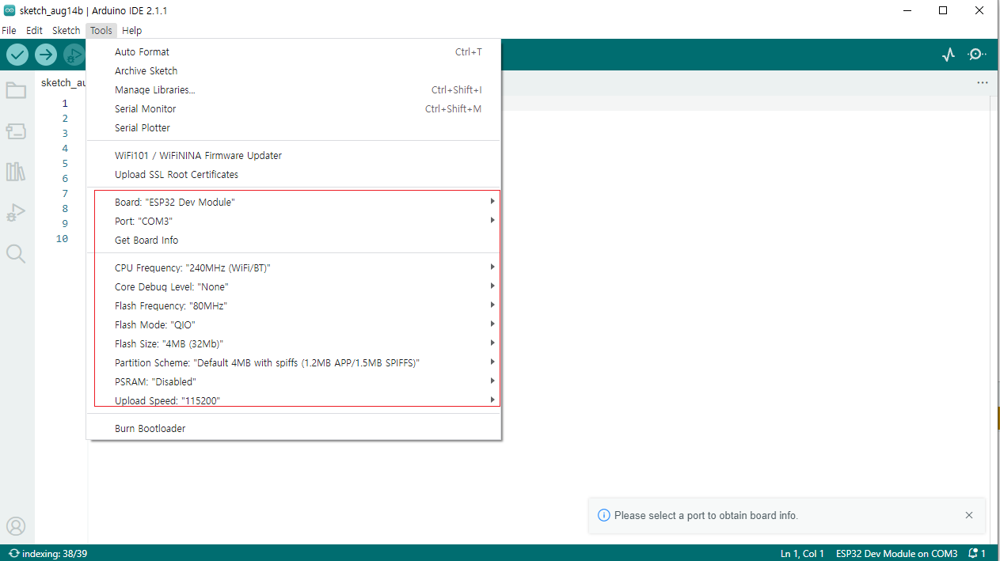

만약 인식이 안 될 경우, 디바이스 드라이버를 추가로 설치해야 합니다.

[해당 링크](https://www.silabs.com/documents/public/software/CP210x_Windows_Drivers.zip)의 zip 파일 안의 실행 파일을 실행 후, 3 과정을 다시 수행합니다.

### 4. 사용 라이브러리 다운로드
`C:\Users\{사용자명}\Documents\Arduino\libraries` 폴더 내에 사용할 라이브러리를 저장합니다.
해당 프로젝트에서는 다음 라이브러리들을 import합니다.
- Arduino-DW1000
- pubsubclient
- EspMQTTClient
### 5. 회로 구성
다음 이미지와 같이 회로를 구성합니다.
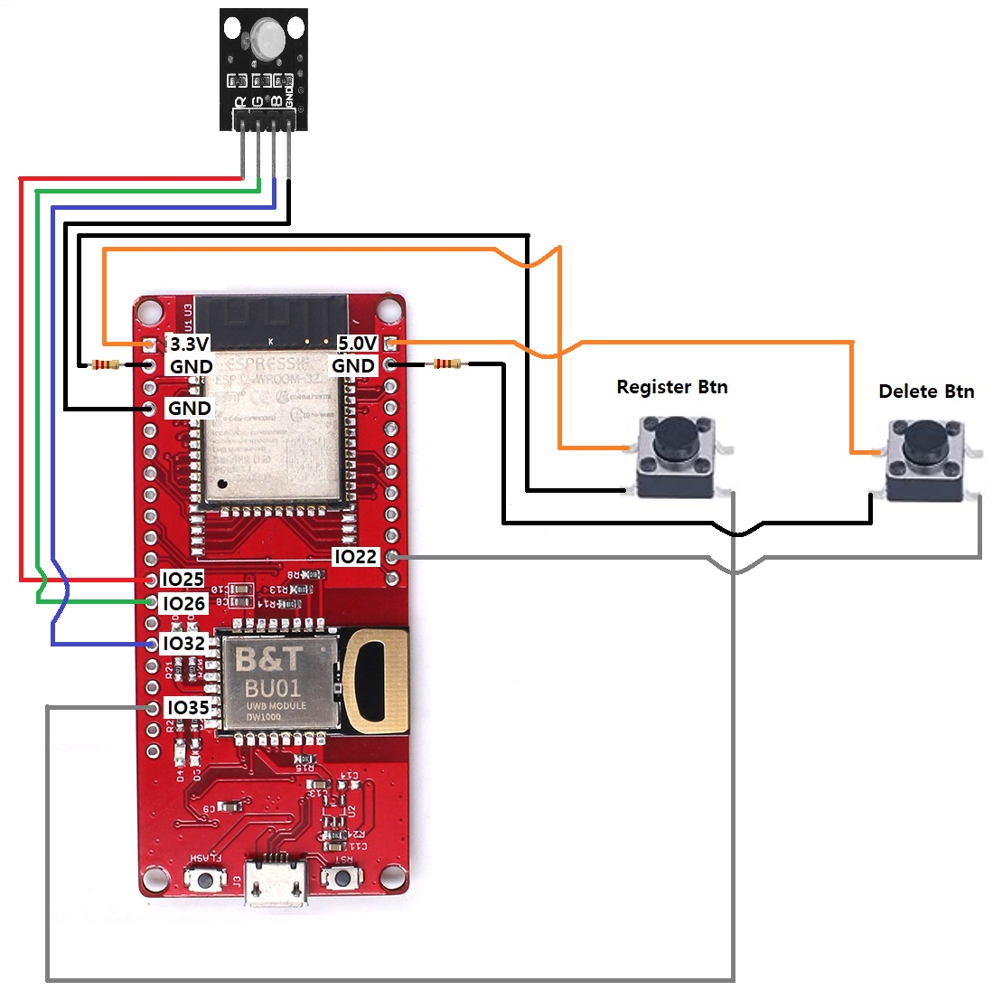
### 6. 스케치 파일 생성
새 스케치 파일을 생성합니다.

파일을 생성할 때, `Anchor` 혹은 `Tag` 용도에 따라 파일 이름을 설정합니다.

해당 이름으로 생성된 폴더에 `.ino` 파일을 작성하거나 저장합니다. 또한 의존 라이브러리 파일이 있다면 같은 경로에 저장합니다.

이 후 board에 스케치 업로드를 진행합니다.

### 연산 프로그램(C/C++ Base)
MQTT libraray / RestAPI TODO
(bridge 디렉토리의 README.md 에 상세 설명)

# 기반 기술

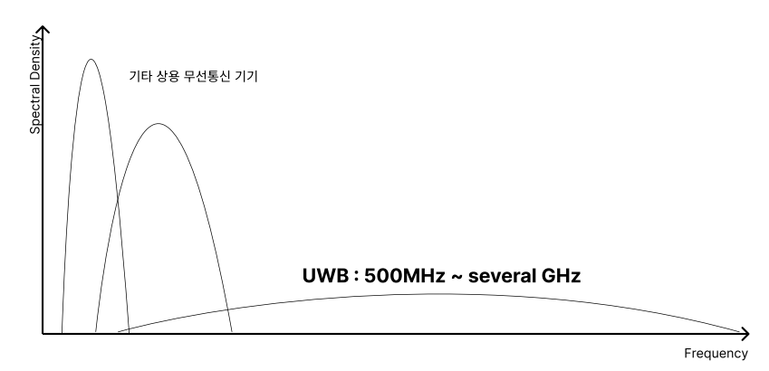

초 광대역(Ultra-Wideband, UWB) 통신은 넓은 주파수 대역을 이용하여 단거리에서 높은 속도로 데이터를 전송하는 무선 통신 기술입니다. 전통적인 좁은 대역 통신 시스템과 달리 UWB는 신호를 GHz 단위로 이루어진 넓은 주파수 대역에 퍼뜨려 전송합니다.

UWB는 다른 무선 통신 기술에 비해 여러 가지 이점을 제공합니다:

1. 고속 데이터 전송: UWB는 아주 높은 데이터 전송 속도를 달성할 수 있으며, 종종 기가비트 단위로 이루어집니다. 이는 멀티미디어 스트리밍이나 고속 파일 전송과 같이 빠르고 효율적인 데이터 전송이 필요한 응용 분야에 적합합니다.
2. 저전력 소비: UWB 장치는 일반적으로 낮은 전력 수준에서 동작하므로, 에너지 효율적이고 스마트폰, 태블릿, 웨어러블 장치와 같은 배터리로 작동하는 장치에 적합합니다.
3. 단거리 통신: UWB는 주로 몇 미터 또는 몇 십 미터 이내의 짧은 거리 통신을 위해 설계되었습니다. 무선 개인 영역 네트워크(WPAN), 무선 센서 네트워크(WSN), 근거리 응용 프로그램과 같은 응용 분야에 적합합니다.
4. 강건성 및 간섭 저항성: UWB 신호는 아주 낮은 전력 수준을 사용하고 넓은 주파수 대역을 차지하기 때문에 다른 무선 기술로부터 간섭을 견딜 수 있습니다. 이는 UWB 장치가 다른 무선 기술과 함께 간섭 문제 없이 공존할 수 있도록 해줍니다.

## TOF(Time of Flight)

신호의 송수신 간의 시간을 측정하여 distance(= T*C)를 구합니다. 

사용할 기법은 double-sided two way 기법으로 TOF를 Tag - Anchor, Anchor - Tag으로 2번 측정하여 더 높은 정확성의 변위를 구하는 방법입니다.

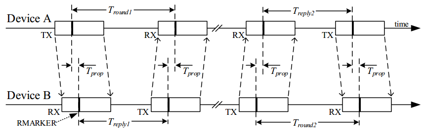

해당 변수들을 통해 시간을 구하는 수식은 다음과 같습니다.

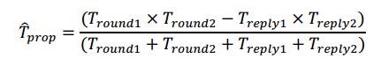

다만, TDoA(Time Difference on Arrival) 방식과 비교할 필요가 있습니다.

기술적으로 TDOA는 내부 clock 간의 동기화가 관건이며 추후 성능 비교를 통해 변위 추정 방식을 선정할 예정입니다.

| 구분 | ToF | TDoA |
| --- | --- | --- |
| Power Consumption | High | Low |
| Tag capacity | Less | More |
| Synchronization Requirements | Low | High |
| Out-of-area positioning | Supported | Not Supported |