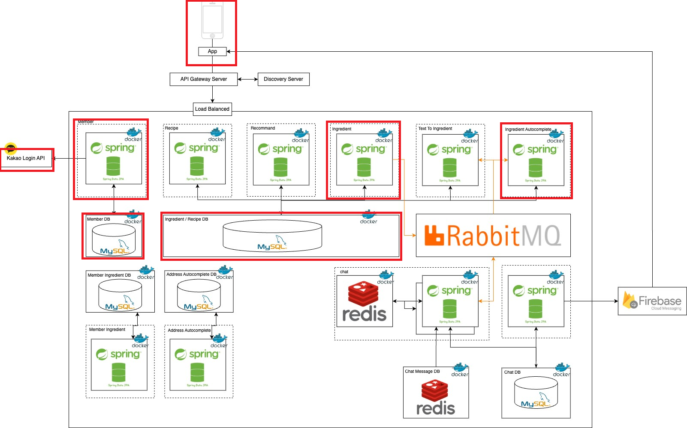
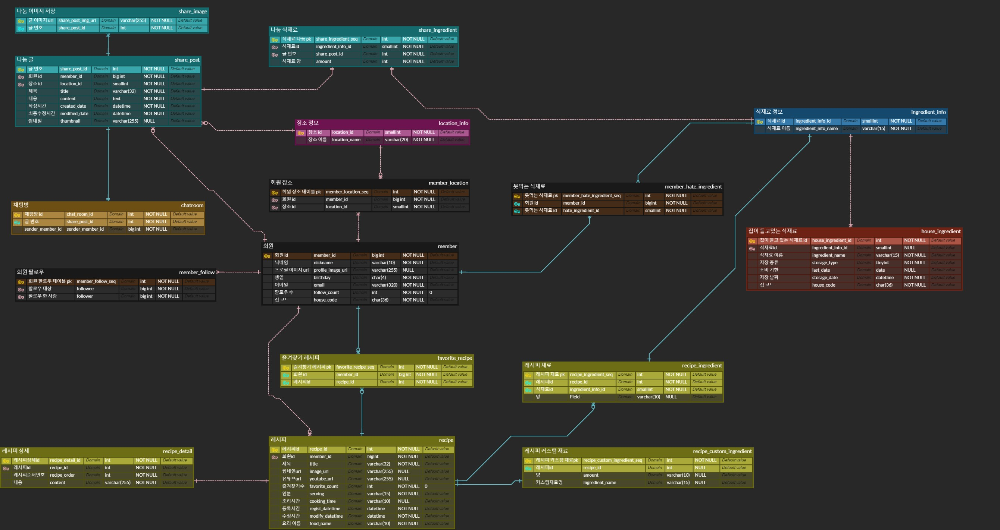

## 프로젝트 2: 간편한 원클릭 기기를 통한 미술품 기록 서비스

**기간**: 7주 (SSAFY 특화 우수 프로젝트 수상)

**상세 주제**: 

재고 기반 레시피 추천, 남는 식재료 나눔, OCR STT등을 통한 쉬운 재고 관리 서비스

- 기획 배경
### 1. '원더프리지' 같은 기존 냉장고 관리 어플리케이션의 한계
- 기존의 냉장고 관리 어플리케이션은 식재료 등록이 번거롭고, 적절한 활용처를 제공해주지 않음
### 2. 여러 명이 한 냉장고를 사용할 때의 어려움
- 가구 구성원끼리 냉장고를 공유하는 경우 정확한 식재료 파악이 어려움
### 3. 소비 패턴의 변화와 그에 따른 식재료 폐기 증가
- 가구 구성원 수가 줄어들고 배달 문화가 발달하면서, 소비기한 내에 먹지 못하고 폐기되는 식재료의 양이 증가함

**전체 시스템 구성도**

(빨간색 부분은 본인이 담당한 파트)

- 사용 언어: Spring boot 2.7.15, React Native
- 개발 내용
    
    MSA로 구성된 Spring WAS 개발, FrontEnd에서 OCR, STT 기능 개발 
    
    - BackEnd ERD

1. Spring boot WAS 개발
- Member Server
    - Kakao 에서 제공하는 OAuth를 이용하여 카카오 인증과 이를 이용한 소셜 로그인 구현
    - S3 스토리지를 이용한 회원가입 유저의 프로필 이미지 등록
    - OpenFeign을 통한 타 서버와의 통신
- Ingredient-Extract Server
    - Aho-Corasick 알고리즘을 통해 주어진 문자열에서 데이터 베이스 내 재료를 빠르게 뽑아내어 사용자에게 가능한 재료의 목록을 빠르게 제공 (OCR, STT와 연결하기 위한 기능)
    - `@PostConstruct`를 이용하여 서버가 켜지는 동시에 데이터 베이스에 있는 데이터를 빠르게 캐싱 데이터로 변환하여 보다 최적화를 가함.
- Share Server
    - 식재료 나눔 글, 사진 등에 대한 CRUD API 서버
1. Application 개발(FrontEnd, React Native) 
    - OCR, STT 구현을 위해 Tesseract library와 Google Cloud Api를 사용해보고 비교해봄.
        
        결과 : Google Cloud Api가 실행시간으로나 정확도상으로 크게 앞서는 것을 확인. 
        
        Google Cloud Api 사용하여 구현
        
    - 레시피 등록, 레시피 관리, 레시피 좋아요 및 목록 구현

- 회고
    - 초기 목표
        - 코드 중복 제거 및 간결하고 SOLID 원칙을 잘 지킨 DRY 코드를 작성하려고 생각하였음
        - 개발 속도를 빠르게 가져가며 Google Play Store 배포까지 진행해보고 싶었음.
    - 문제점
        - 전체 : 예상보다 기획이 너무 오래 걸림(3주차 말에 끝남)
        - 백엔드 : DTO를 Entity로 바꾸거나 Error Response 등을 처리하는데 많은 코드를 중복시킴.
        - 백엔드: MSA 구조가 불러오는 코드의 중복이 생김.
    - 개선하려고 시도한 점
        - MapStruct를 나중에 도입하고 서비스 단에 DTO Entity간 변환 코드를 두지 않고 Converter를 따로 두어 사용함.
        - MSA를 멀티 모듈로 쪼갠 후 필요시 추가 마이크로 서버로 분리하려 기획해봄. 그러나 마이크로 서버가 늘어날 수록 설정이 많고 전체적인 서비스가 더더욱 복잡해져 복잡도 증가만 야기함.
    - 추후 개선 방안
        - 성공적인 멀티 모듈 프로젝트 참고하기
        - Spring Framework가 아닌 Go언어 등 다양한 프레임워크를 참고해보며 적절한 방법을 탐구해보는 것이 좋다고 생각함.