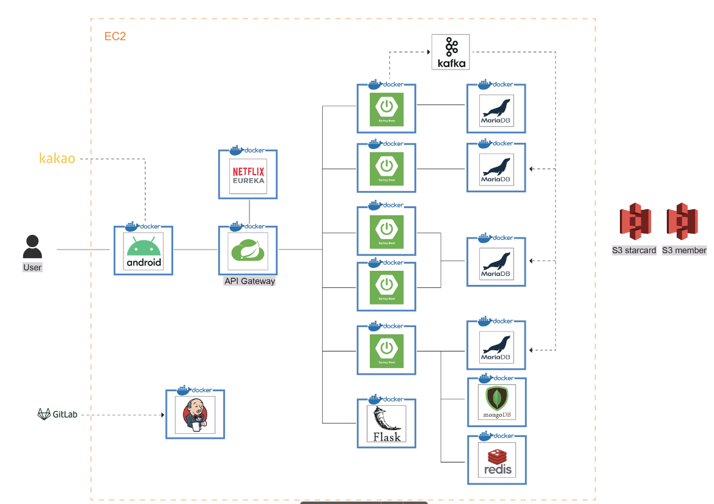
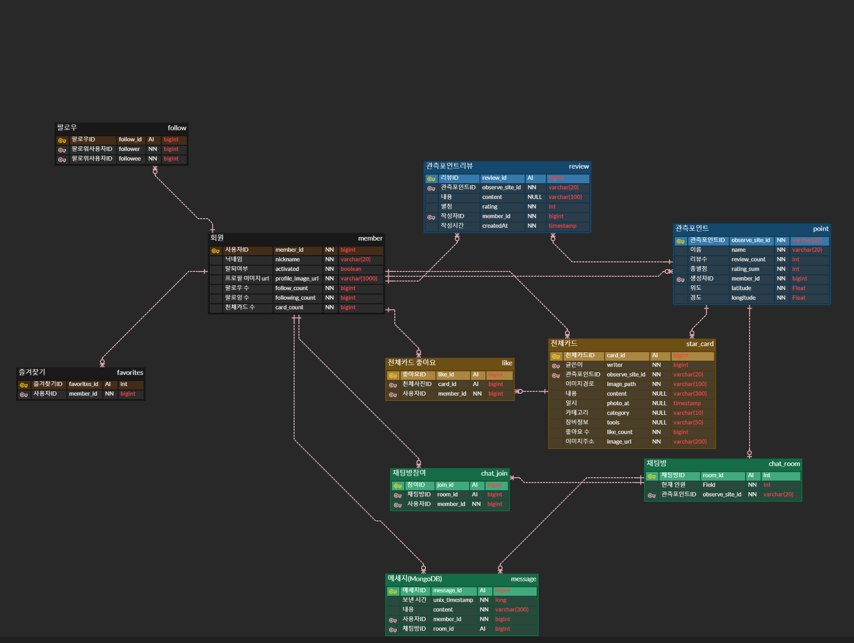
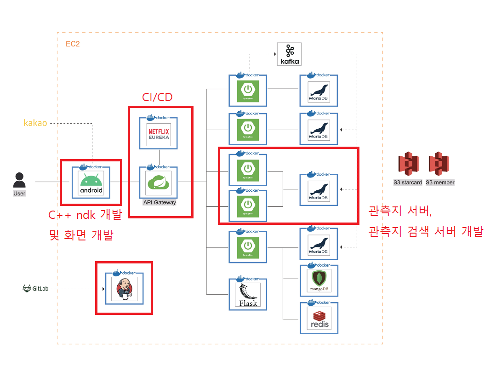

# 천구 투영 및 별사진 인식 앱 Stellargram

# 기획 배경 및 프로젝트 소개
- [기획 배경 및 프로젝트 소개](exec/1.%20기획%20배경%20및%20프로젝트%20소개.md)

# 💁 설계

## 🧱 서비스 아키텍쳐

## 📱 와이어프레임  
- [와이어프레임 사이트](https://www.figma.com/file/8HSSYFTxHEk9PhSd8cHjbh/Stellargram?type=design&node-id=0-1&mode=design) 참조
  
## 🎨 ERD

 
## 📬 API 명세서
- [API 명세서](https://potent-light-313.notion.site/API-10bb1c1e8cbd40e9b7701a2e90bad9d8?pvs=4) 참조
  
## 📋 컨벤션
- [컨벤션](https://potent-light-313.notion.site/Convention-bdade896368546fe8ae8f57ac4e02a4b?pvs=4) 참조  

# 📡 업무

(빨간 색으로 표현한 것은 본인이 진행한 업무)

## Backend

### 1. CI / CD

- MSA 구조를 위해 Member, Starcard, Observe-site, Observe-search, Chat 서버로 구성함. 
- MSA 구조를 사용하기 때문에 DB의 Foreign Key constraint와 같은 문제점들이 생김. 이 해결책은 본인이 제시하지 않았으나 Kafka를 통한 메시지 큐 서버로 해결하려고 노력함. 프로젝트 종료 후 Debezium과 같은 CDC tool이 있음을 확인함. 

### 2. Observe-site 서버

- 기본 적인 CRUD 서버. Observe-site와 Observe-site를 참조하는 Review 테이블이 있음. 
- 리뷰가 추가될때 해당 Observe-site의 평점이 업데이트되고 해당 Observe-site의 모든 리뷰의 평점을 불러와야 하는 일이 생김. 조회를 막기 위해 총 평점을 저장하고 추가되는 리뷰의 평점을 추가하는 방식

### 3. Observe-search 서버

- 효율적인 검색을 위해 효율적인 알고리즘을 생각함. Sqrt Decomposition에서 먼저 해당 원소를 검색할 때 큰 단위에서 검색 후 작은 단위 검색을 하는 것에 착안, 큰 청크에서의 검색 이후 작은 청크의 검색을 진행하는 구조로 되어 있음. 
- 캐싱을 통해 서버가 켜지는 경우 DB의 결과물을 모두 불러오고 OpenFeign을 통해 원소의 업데이트가 있는 경우 이를 진행함. 

## Frontend

### 4. C++ NDK를 사용한 최적화

- 천구를 화면에 띄우고 화면전환 및 시간이 흐름에 따라 화면을 재렌더링 하는 과정에서 굉장히 많은 시간이 소요.(1.13s) 이를 최적화하고자 C++로 전환하였고 여러 최적화 기법을 통해 16ms 이하로 실행시간을 줄임. 
- SIMD 기법을 이용해 한번의 연산에 2개의 행을 한번에 덧셈.
- KIJ 방법을 통해 더욱 더 빠른 행렬 계산을 행함. 

# ✏️회고

1. 기존의 목표

- API-gateway를 통해 인가를 포함, API routing 성공
- Observe-Search 서버는 DB의 변화가 생기면 해당 부분만 전달 받는 알리미를 두려고 함.
- Observe-Search 서버의 조회를 효율적으로 하기.
- 천구의 계산을 보다 효율적이고 3차원 화면을 2차원 평면으로 효율적으로 표현하고 싶었음.

2. 달성하지 못한 것

- 인가가 프로그램의 결과물에 잘 드러나지 않고 큰 차이가 없어 우선순위가 밀려 결국 개발하지 못 함. 만일, 추가로 진행하였다면 보다 로직의 분리가 더 완벽히 되지 않았을까 생각해봄. 
- 알리미는 OpenFeign으로 구현하였으나 만일 신호 수신에 실패하였을 때를 대비한 로직을 완벽하게 구현하지 못함. 어쩌면 Debezium이나 다른 CDC 툴로 처리를 하는 것이 좋지 않았을까 생각해봄. 
- Sqrt Decomposition은 $ O(n^0.5) $의 복잡도를 가지지만, 2D seg tree를 사용한다면 $ O(\log{n}) $의 시간 복잡도가 걸린다. 후자도 개발하여 더 나은 것을 사용했어야 하지만 그러지 못하였다. 
- 점, 선에 대한 변환은 어느 정도 완벽하게 되었다고 생각하나 이미지와 같은 은하수 이런 것들은 엄두를 내지 못함. 지식의 부족이 아니었나 반성해봄. 조금 더 알아보고 해당 부분을 구현할 수 있으면 좋겠다고 생각함. 