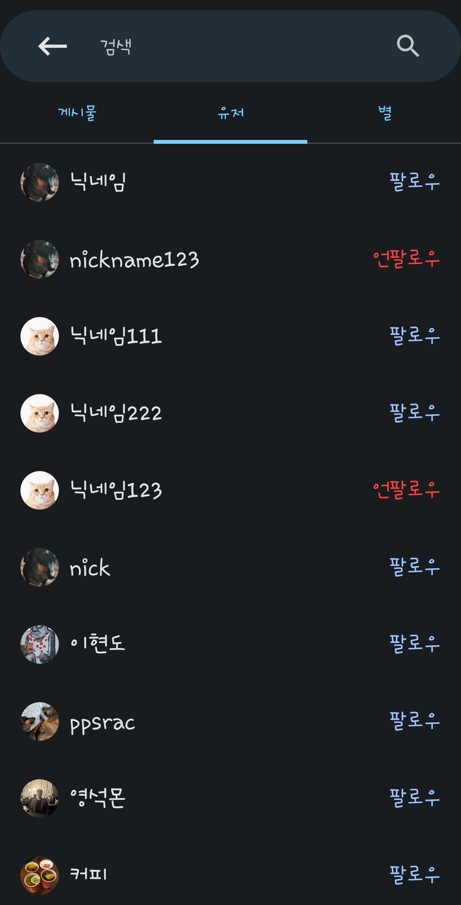
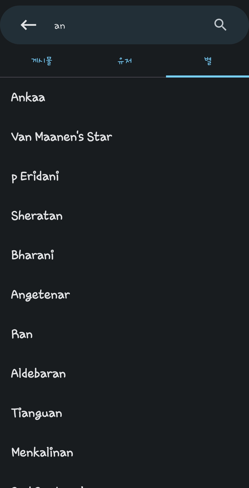
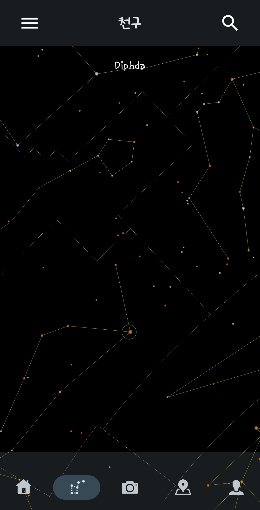
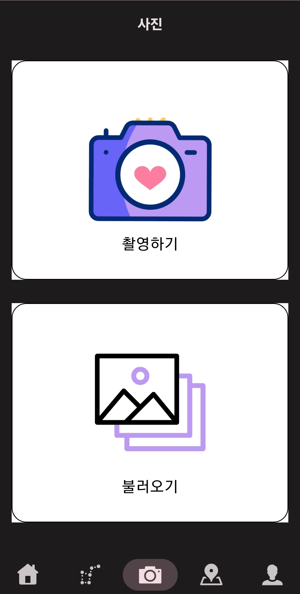
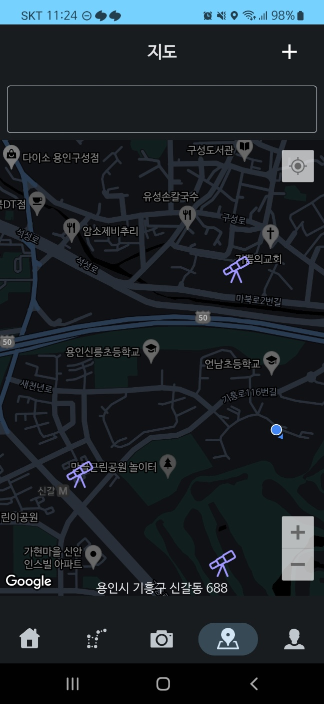
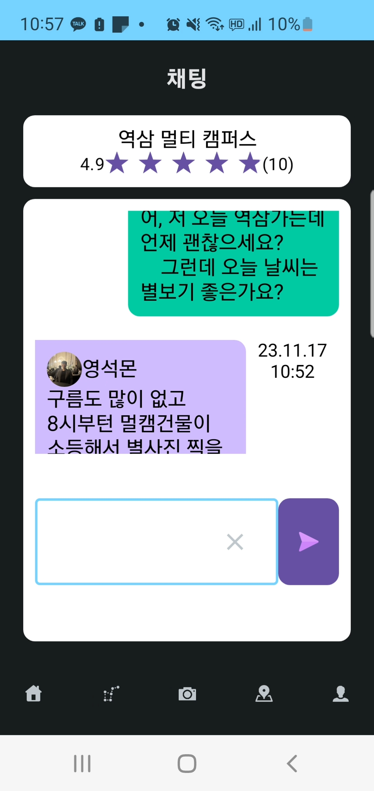
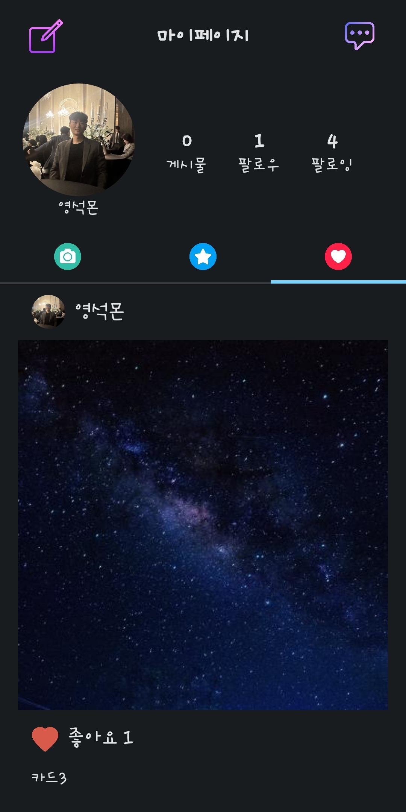
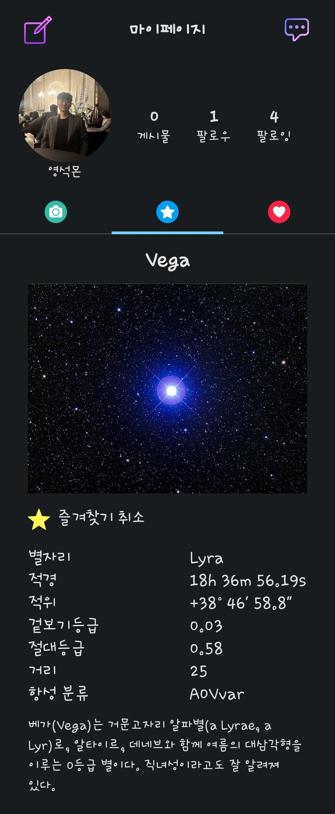

### 별들을 더 가까이, 별들을 소장하고 싶은 사람들을 위하여

## ✨ 기획 배경
### 1. 기존 어플리케이션이 천체 관측에 대한 진입장벽을 낮춰주지 못 함.
- 기존의 어플리케이션은 대다수 사용자가 천체 관측을 진행할 수 있도록 도와주는 가이드 기능이 부재되어 있음.
### 2. 고가의 천체관측기기
- 현재 망원경, DSLR 등을 구매하려고 하면 수십만원의 고비용이 발생함. 그러나 대다수 사용자가 보유한 스마트폰으로 양질의 천체 사진을 촬영할 수 있음. 
### 3. 정보 공유를 위한 커뮤니티의 부재
- 천체 관측을 하기 위해서는 많은 가이드가 필요하나, 이러한 정보를 얻을 수 있는 커뮤니티가 부족함.

## 📆 프로젝트 소개
* **프로젝트명**

  별들을 더 가까이, 별들을 소장하고 싶은 사람들을 위한 앱 Stellargram

* **서비스 특징** 

  * C++ NDK를 이용한 부드러운 3D 천체 투영 구현.
  * CameraX 및 Camera2 기능을 활용한 천체 사진용 인앱 카메라 제공.
  * Google Maps를 이용한 관측 포인트 정보 제공과 웹소켓과 Redis Pub/Sub을 이용한 관측포인트 당 채팅 기능 구현.

## 🙌주요 기능
### 1. 천체 투영기능
다양한 조작을 통해 원하는 시각, 배율, 방향에 따른 하늘을 투영해줌.

- 스크롤을 통한 방향 전환, 줌인 줌아웃을 통한 배율을 조정할 수 있음.
- 하단의 시간 조절 탭을 이용해 원하는 시각의 하늘을 투영시킬 수 있음.
- 검색 탭을 이용해 원하는 천체를 검색해 볼 수 있음. 

### 2. 천체 사진 기능
사용자에게 천체 사진을 촬영할 수 있도록 안내를 제공하고 직접 촬영할 수 있도록 해 줌. 

- ISO, 노출 시간, WB(White Balance) 조정을 제공해주고 하단의 안내 문구를 통해 사용자가 간단하게 천체 사진을 촬영할 수 있도록 해 줌.
- 촬영한 사진에 어떠한 천체가 포함되어 있는지 확인할 수 있음.
- 사진에 별자리 표시 등 커스텀 설정을 제공하여 천체 사진을 더욱 이쁘게 꾸밀 수 있음.
- 촬영한 사진을 다양한 사용자와 공유할 수 있음. 

### 3. 천체 관측소 정보 공유
사용자에게 천체 관측에 적합한 장소 정보를 제공해주고, 다양한 사용자와 정보 공유를 할 수 있는 채팅 기능을 제공해 줌.

- Google Maps에 다양한 관측지를 망원경 모양의 아이콘으로 표시해주고 누를 시 상세 정보와 함께 채팅에 입장할 수 있도록 함.
- 길게 누르기와 버튼 선택이라는 행동을 통해 간단하게 관측 포인트 등록을 할 수 있고, 별점 및 코멘트를 통해 관측지에 대한 평가를 진행할 수 있음. 
- 채팅 기능을 통해 다양한 사용자와 해당 관측지에 대한 정보를 공유할 수 있음. 

## 화면정의

## 1. 랜딩페이지

### * 로그인
OAuth를 통한 카카오 로그인이 가능하다. 기존 회원은 바로 메인화면으로 보내고, 미가입 회원은 카카오 프로필사진을 받고 직접 닉네임을 설정해 회원가입을 할 수 있다.
 

## 2. 메인

### * 날씨정보 제공
화면 상단에서 기상청 API를 통해 우천여부, 기온, 위치 등 실시간 기상정보를 알 수 있다.

### * 오늘의 사진
좋아요 수 등에 기반한 오늘의 사진을 추천해준다.

## 3. 게시물 검색

메인화면과 천체페이지에 각각 우측상단에 있는 돋보기 아이콘 클릭을 통해 접근할 수 있다.

### * 게시물 검색
키워드를 입력하면 해당 키워드가 게시물 내용에 포함되어있는 게시물들을 나열해준다. 작성자를 확인하고 팔로우/언팔로우 할 수 있으며 카드를 좋아요/좋아요취소 가능하다.

## 4. 유저 검색

### * 유저 검색
해당 키워드가 포함된 닉네임의 유저들을 나열해준다. 클릭 시 해당 회원의 마이페이지로 이동하며 검색페이지에서 팔로우/언팔로우가 가능하다.

## 5. 천체 검색

### * 천체 검색
키워드가 포함된 천체들을 나열해준다. 클릭 시 해당 천체의 상세보기 페이지로 이동한다.

## 6. 천구

원하는 방향, 배율에 따라 하늘을 투영해주는 화면이다. C++ NDK를 통해 부드러운 3D 천체 투영을 구현했다. 또한 별들에게 반짝이는 효과를 넣어 실제 만원경으로 관측할 때의 느낌을 살리고자 하였다.

### * 방향, 배율 설정
스크롤, 줌 인/아웃으로 보고싶은 부분을 확대/축소하여 관찰할 수 있고, 밝기와 거리에 따라 화면에 보이는 별들을 제한함으로써 성능을 향상시키고 직관성을 더했다.

### * 별자리 구현
별자리 영역을 나눔으로써 각 별자리 형태를 한눈에 확인할 수 있다.

### * 천체 정보 제공
화면에 보이는 별을 클릭하면 이름을 알려주고, 이름을 클릭하면 해당 별의 상세페이지로 이동한다.

## 7. 천체 상세정보

천체 검색이나 천구페이지의 특정별을 클릭하여 접근할 수 있는 페이지다. 별의 이름과 사진 및 별자리 등의 정보를 제공하며, 일부 별들은 설명을 제공한다.

## 8. 촬영/인식

CameraX 및 Camera2를 활용한 인앱카메라를 제공한다. 또한 밤하늘을 직접 촬영하거나 이미 찍은 사진을 갤러리에서 받아와 등록하면, 해당 사진에서 별들을 인식하여 어떤 별과 별자리인지 알려준다. 또한 해당 사진으로 게시물을 등록하여 사람들과 공유할 수 있다.

## 9. 지도

Google Maps API를 통해 실제 지도에 기반하여 <1. 관측소 등록 2. 관측소 리뷰 3. 관측소 채팅>과 같은 기능을 수행할 수 있다.

### * 관측소 등록
Google Maps 지도에 핀(관측소)을 등록하여 해당 지역의 주소에 기반한 관측소를 세울수 있으며, 추후 해당 관측소에 대해 리뷰, 채팅 등의 기능을 사용할 수 있다.

## 10. 채팅

생성된 관측소에서 유저들이 해당 관측소에 대한 정보를 공유할 수 있다. 프로필 사진과 닉네임을 통해 유저를 식별할 수 있으며, Stomp, 웹소켓 및 Redis Pub/Sub을 활용한 실시간 채팅이 가능하다.

## 11. 마이페이지
프로필사진, 닉네임, 게시물 수, 팔로워/팔로잉 수 등을 확인할 수 있는 마이페이지이다. 프로필 수정, 채팅방 목록 확인, 내 게시물/즐겨찾는 별/좋아하는 게시물 등을 확인할 수 있다.

### * 내 게시물

내가 등록한 게시물들을 확인할 수 있다.

### * 즐겨찾는 별

천체 상세페이지에서 즐겨찾기 등록한 별들을 확인할 수 있다. 즐겨찾기 취소 기능이 제공된다.

### * 좋아하는 게시물

좋아요한 게시물들을 확인할 수 있다. 내 게시물이 아니라면 유저를 팔로우/언팔로우 할 수 있다.