# 화면정의서 문서

## 1. 랜딩페이지
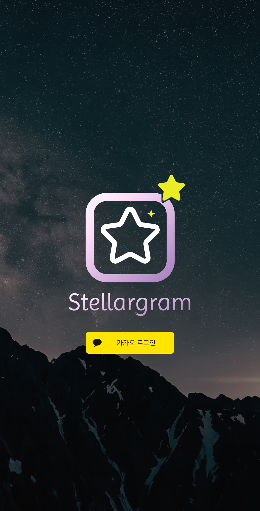
### * 로그인
OAuth를 통한 카카오 로그인이 가능하다. 기존 회원은 바로 메인화면으로 보내고, 미가입 회원은 카카오 프로필사진을 받고 직접 닉네임을 설정해 회원가입을 할 수 있다.
 

## 2. 메인
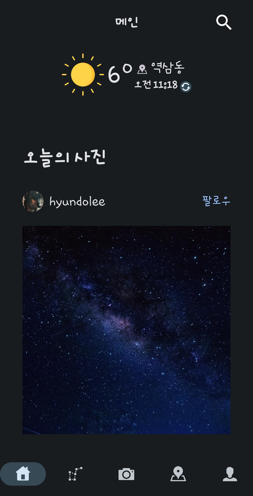
### * 날씨정보 제공
화면 상단에서 기상청 API를 통해 우천여부, 기온, 위치 등 실시간 기상정보를 알 수 있다.

### * 오늘의 사진
좋아요 수 등에 기반한 오늘의 사진을 추천해준다.

## 3. 게시물 검색
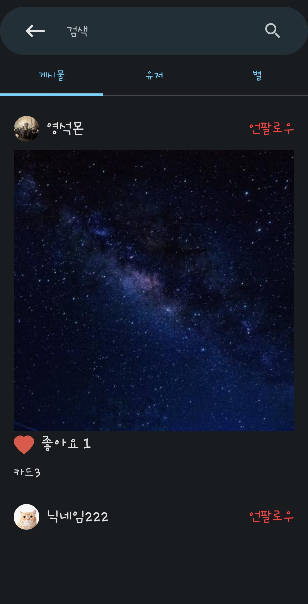

메인화면과 천체페이지에 각각 우측상단에 있는 돋보기 아이콘 클릭을 통해 접근할 수 있다.

### * 게시물 검색
키워드를 입력하면 해당 키워드가 게시물 내용에 포함되어있는 게시물들을 나열해준다. 작성자를 확인하고 팔로우/언팔로우 할 수 있으며 카드를 좋아요/좋아요취소 가능하다.

## 4. 유저 검색
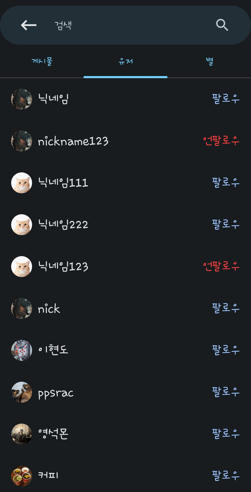

### * 유저 검색
해당 키워드가 포함된 닉네임의 유저들을 나열해준다. 클릭 시 해당 회원의 마이페이지로 이동하며 검색페이지에서 팔로우/언팔로우가 가능하다.

## 5. 천체 검색
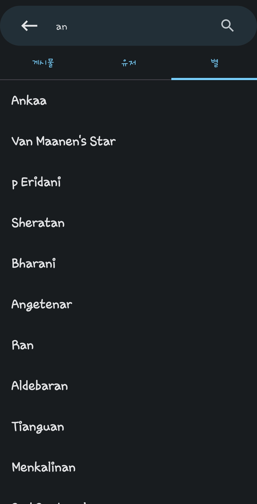

### * 천체 검색
키워드가 포함된 천체들을 나열해준다. 클릭 시 해당 천체의 상세보기 페이지로 이동한다.

## 6. 천구
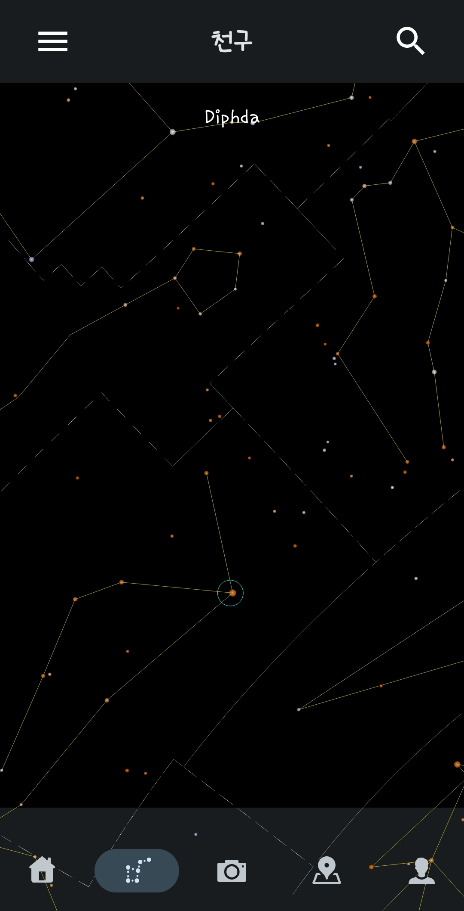
원하는 방향, 배율에 따라 하늘을 투영해주는 화면이다. C++ NDK를 통해 부드러운 3D 천체 투영을 구현했다. 또한 별들에게 반짝이는 효과를 넣어 실제 만원경으로 관측할 때의 느낌을 살리고자 하였다.

### * 방향, 배율 설정
스크롤, 줌 인/아웃으로 보고싶은 부분을 확대/축소하여 관찰할 수 있고, 밝기와 거리에 따라 화면에 보이는 별들을 제한함으로써 성능을 향상시키고 직관성을 더했다.

### * 별자리 구현
별자리 영역을 나눔으로써 각 별자리 형태를 한눈에 확인할 수 있다.

### * 천체 정보 제공
화면에 보이는 별을 클릭하면 이름을 알려주고, 이름을 클릭하면 해당 별의 상세페이지로 이동한다.

## 7. 천체 상세정보
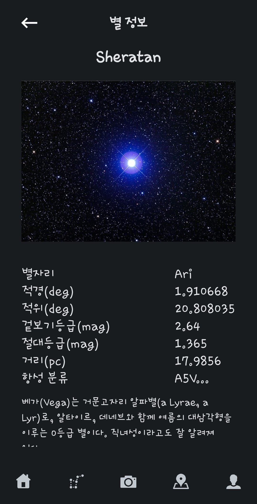
천체 검색이나 천구페이지의 특정별을 클릭하여 접근할 수 있는 페이지다. 별의 이름과 사진 및 별자리 등의 정보를 제공하며, 일부 별들은 설명을 제공한다.

## 8. 촬영/인식
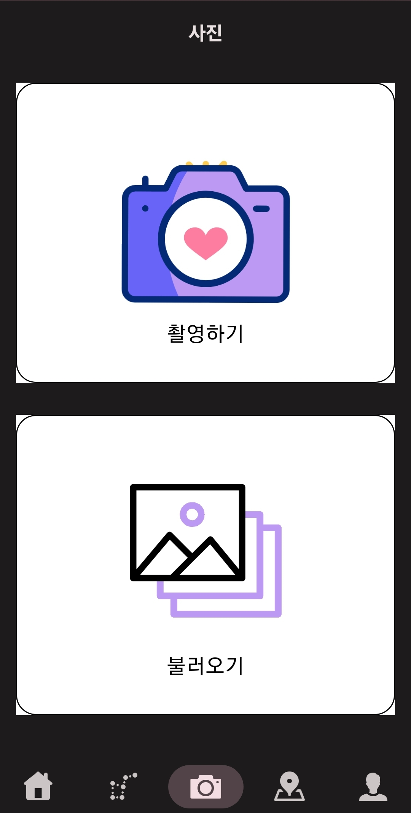
CameraX 및 Camera2를 활용한 인앱카메라를 제공한다. 또한 밤하늘을 직접 촬영하거나 이미 찍은 사진을 갤러리에서 받아와 등록하면, 해당 사진에서 별들을 인식하여 어떤 별과 별자리인지 알려준다. 또한 해당 사진으로 게시물을 등록하여 사람들과 공유할 수 있다.

## 9. 지도
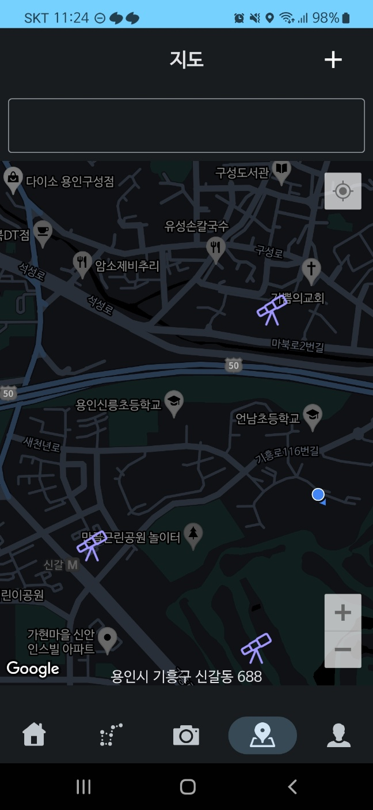
Google Maps API를 통해 실제 지도에 기반하여 <1. 관측소 등록 2. 관측소 리뷰 3. 관측소 채팅>과 같은 기능을 수행할 수 있다.

### * 관측소 등록
Google Maps 지도에 핀(관측소)을 등록하여 해당 지역의 주소에 기반한 관측소를 세울수 있으며, 추후 해당 관측소에 대해 리뷰, 채팅 등의 기능을 사용할 수 있다.

## 10. 채팅
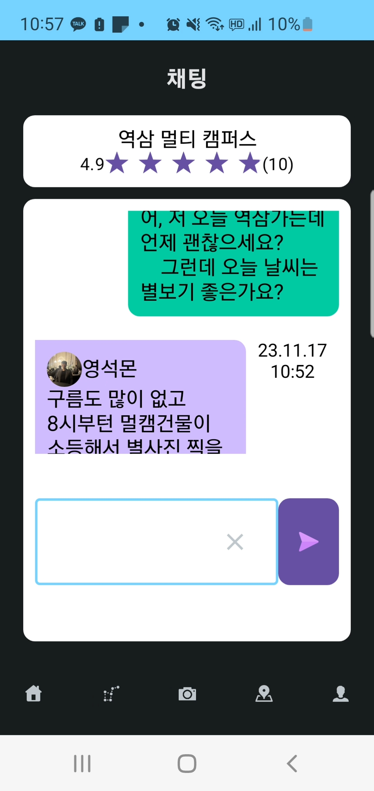
생성된 관측소에서 유저들이 해당 관측소에 대한 정보를 공유할 수 있다. 프로필 사진과 닉네임을 통해 유저를 식별할 수 있으며, Stomp, 웹소켓 및 Redis Pub/Sub을 활용한 실시간 채팅이 가능하다.

## 11. 마이페이지
프로필사진, 닉네임, 게시물 수, 팔로워/팔로잉 수 등을 확인할 수 있는 마이페이지이다. 프로필 수정, 채팅방 목록 확인, 내 게시물/즐겨찾는 별/좋아하는 게시물 등을 확인할 수 있다.

### * 내 게시물
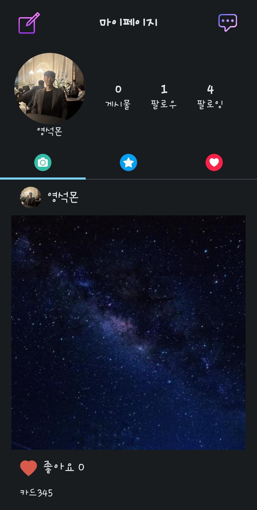
내가 등록한 게시물들을 확인할 수 있다.

### * 즐겨찾는 별
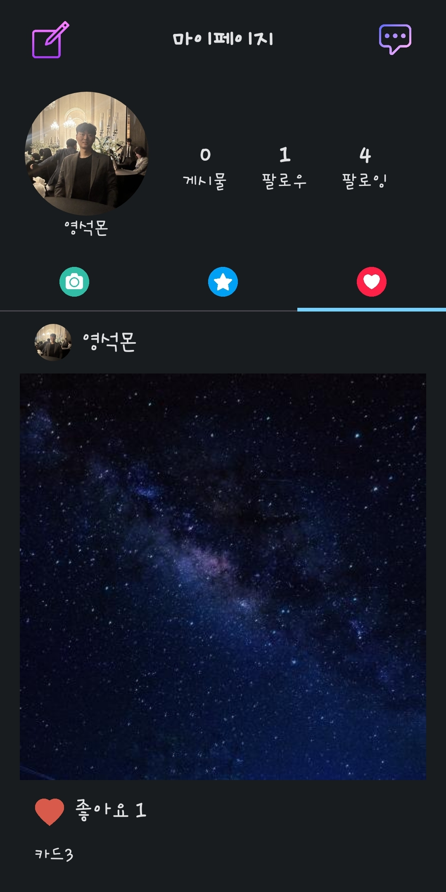
천체 상세페이지에서 즐겨찾기 등록한 별들을 확인할 수 있다. 즐겨찾기 취소 기능이 제공된다.

### * 좋아하는 게시물
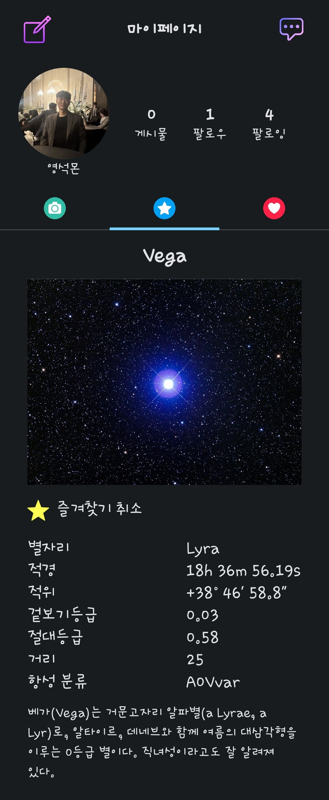
좋아요한 게시물들을 확인할 수 있다. 내 게시물이 아니라면 유저를 팔로우/언팔로우 할 수 있다.